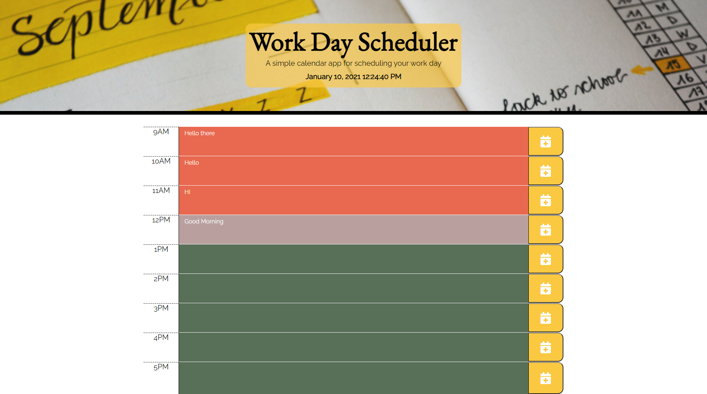

# Work Day Scheduler Starter Code
## General Info

*  Created a Work Day Scheduler using HTML, CSS, JS, JQuery, and MomentJS

*  User can input task for each hour

*  Scheduler can show whether the scheduled block is in the future, current, or in the past

*  When user refreshes, tasks are saved and re-dsiplayed on the page

*  Link to Deployed Site: (https://jnunez1229.github.io/day-scheduler/)
 
### Screenshot

---